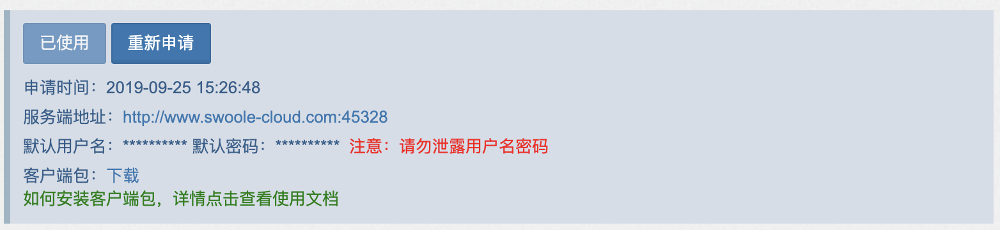

>[danger] Swoole Tracker 目前仅支持 Linux 系统，不支持Unix、Windows、Mac OS；不支持ARM架构；支持 PHP5.4、5.5、5.6、7.0、7.1、7.2、7.3、7.4、8.0。

[TOC]
## 安装部署
### 第一步：后台申请
在[官网](https://business.swoole.com/SwooleTracker/catdemo)申请使用后，会看到如下信息

>[success] 安装或更新 步骤相同，更新需要点击重新申请；卸载直接卸载扩展，关闭客户端进程（可参见下文管理客户端进程）。



### 第二步：安装Agent进程
点击客户端包后的**下载**，会得到一个名为`swoole-tracker-install.sh`的脚本，上传到机器后进行如下操作：
>[danger] 如果使用 wget 下载，文件名为注册的手机号，操作和下文相同

```bash
chmod +x swoole-tracker-install.sh

./swoole-tracker-install.sh
```
执行完成后，会在当前目录下生成`swoole-tracker`文件夹，目录结构如下
```
.
├── app_deps
├── deploy_env.sh
├── inst.sh
├── musl-compat
├── swoole_tracker54.so #对应各版本的扩展
├── swoole_tracker55.so
├── swoole_tracker56.so
├── swoole_tracker70.so
├── swoole_tracker71.so
├── swoole_tracker72.so
├── swoole_tracker73.so
└── swoole_tracker74.so
```

### 第三步：安装扩展

根据你的机器PHP版本安装对应的扩展，复制对应的扩展到PHP环境扩展安装目录

>[info] 获取扩展安装目录：php -ini | grep extension 或者php -r "echo @ini_get("extension_dir").PHP_EOL;"

```
cp swoole_tracker70.so /your_php_extensions_path/swoole_tracker.so
```
> [danger] 若扩展安装不上，可使用下载包中的`inst.sh`进行安装，或者联系识沃客服寻求帮助

在 `php.ini` 中加入以下配置

```ini
extension=swoole_tracker.so

;打开总开关
apm.enable=1
;采样率 例如：100%
apm.sampling_rate=100

;开启内存泄漏检测时添加 默认0 关闭状态
apm.enable_memcheck=1
```
>[danger] `enable`为 1 时表示调用统计百分百拦截并上报
> `sampling_rate`采样率只作用于链路追踪，设置为 100 则表示每次请求都会生成一条 trace 数据

#### 卸载不兼容扩展

1. xdebug
2. ioncube loader
3. zend guard loader
4. xhprof
5. swoole_loader （加密后的代码不能进行分析）

### 第四步：重启PHP服务

安装完成后，需要**重启对应的 SwooleServer 或者 php-fpm 服务**，发生请求后稍等片刻，等待服务端接收客户端发送的数据。

>[success] 以上操作会在宿主机直接安装，如果你需要在Docker中部署，请看下文

## 在Docker环境中部署客户端

>[danger] 请注意修改相关路径为你自己的路径！！！以下的swoole.so只是演示说明可安装其他扩展，swoole_tracker不依赖swoole扩展

在docker环境部署需要修改Dockerfile或者docker-compose.yml或者在`docker run`命令中添加参数，以下以采用官方docker-compose v3.7配置文件格式，php:fpm-7.x(-alpine)镜像为例，描述如何在docker部署

### 修改Dockerfile以部署node-agent

在Dockerfile中执行 `swoole-tracker-install.sh` 来部署node-agent，然后在entrypoint中添加node-agent，例如

```dockerfile
# dockerfile的其他部分

# 部署node-agent
ADD swoole-tracker-install.sh /tmp/
RUN chmod +x /tmp/swoole-tracker-install.sh && \
    cd /tmp/ && \
    ./swoole-tracker-install.sh && \
    rm /tmp/swoole-tracker-install.sh

# 添加entrypoint脚本
RUN printf '#!/bin/sh\n/opt/swoole/script/php/swoole_php /opt/swoole/node-agent/src/node.php &\nphp-fpm $@' > /opt/swoole/entrypoint.sh && \
    chmod 755 /opt/swoole/entrypoint.sh

# 启用entrypoint脚本（-x方便调试， 可以去掉）
ENTRYPOINT [ "sh", "-x", "/opt/swoole/entrypoint.sh" ]
```

### 启用扩展

对于官方镜像php:fpm系列，php(-fpm)默认读取/usr/local/etc/php/conf.d下的配置文件，默认的entrypoint会将"-"开头的参数作为fpm启动参数，因此可以采用以下方式启用swoole_tracker扩展

在Dockerfile添加配置文件：

```dockerfile
RUN printf 'extension=/path/to/swoole.so\nextension=/path/to/swoole_tracker7x.so\n' > /usr/local/etc/php/conf.d/swoole-tracker.ini
```

或在docker-compose.yml添加启动参数

```yml
services:
  your-service:
    build:
      context: cgi-docker
      dockerfile: Dockerfile
    image: myphpfpm:1
    command:
      - "-dextension=/path/to/swoole.so"
      - "-dextension=/path/to/swoole_tracker7x.so"
```

或在docker run命令中添加启动参数

```bash
docker run --other-arguments myphpfpm:1 -dextension=/path/to/swoole.so -dextension=/path/to/swoole_tracker7x.so
```

### 配置docker安全选项

扩展中使用了默认权限不允许的系统调用，使用了docker默认seccomp配置不允许的系统调用，需要额外配置：

参考https://docs.docker.com/engine/security/seccomp/

对于权限配置，可以添加SYS_PTRACE cap，或者使用提升权限模式（不推荐）

对于seccomp，可以修改seccomp配置，或关闭seccomp配置（不推荐，这将导致docker内程序可以执行create_module，kexec_load等危险系统调用）

### 修改seccomp配置

修改seccomp配置文件（修改自[默认文件](https://github.com/moby/moby/blob/master/profiles/seccomp/default.json))）:

```
--- a.json
+++ b.json
# 在.syscalls[0].names中加入"ptrace"，这将允许ptrace
@@ -359,7 +359,8 @@
                                "waitid",
                                "waitpid",
                                "write",
-                               "writev"
+                               "writev",
+                               "ptrace"
                        ],
                        "action": "SCMP_ACT_ALLOW",
                        "args": [],
# 如果你的docker较新，则它已经配置了ptrace在4.8以上内核可用
# 参考https://github.com/moby/moby/commit/1124543ca8071074a537a15db251af46a5189907
# 移除这段
@@ -369,18 +370,6 @@
                },
-                {
-                        "names": [
-                               "ptrace"
-                       ],
-                       "action": "SCMP_ACT_ALLOW",
-                       "args": null,
-                       "comment": "",
-                       "includes": {
-                               "minKernel": "4.8"
-                       },
-                       "excludes": {}
-               },
               {
                       "names": [
                                "personality"
                        ],
                        "action": "SCMP_ACT_ALLOW",
```

在docker run使用该seccomp并给予SYS_PTRACE权限：

```bash
docker run --other-arguments --cap-add=SYS_PTRACE --security-opt seccomp=/path/to/that/modified/profile.json ...
```

或docker-compose.yml中:

```yml
# 在docker-compose.yml中：
services:
  your-service:
    build:
      context: cgi-docker
      dockerfile: Dockerfile
    image: myphpfpm:1
    # 给予SYS_PTRACE权限
    cap_add:
      - "SYS_PTRACE"
    # 配置使用修改的seccomp
    security_opt:
      - "seccomp=/path/to/that/modified/profile.json"
```

### 关闭seccomp（不推荐）

与修改配置类似，但不需要创建json，将 `seccomp=/path/to/that/modified/profile.json`换成`seccomp=unconfined`即可

## 管理客户端进程

查看 [常见问题](qa.md) 中的「管理NodeAgent守护进程」