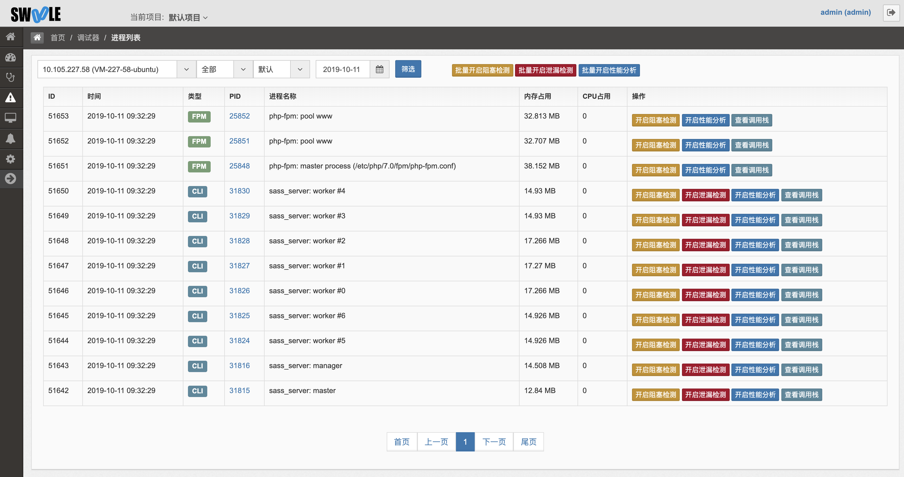
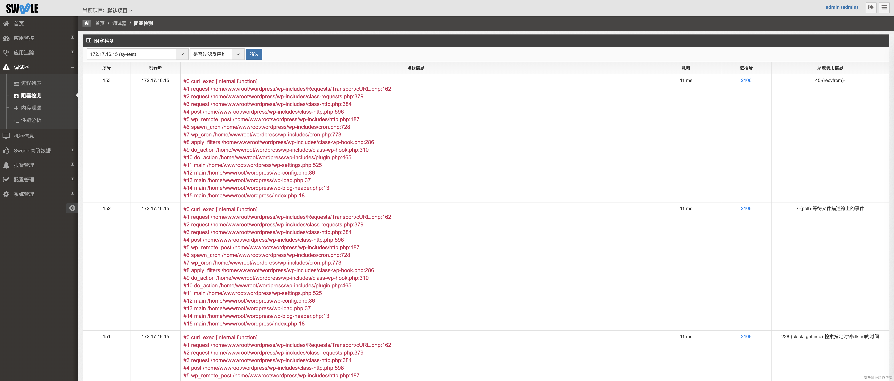
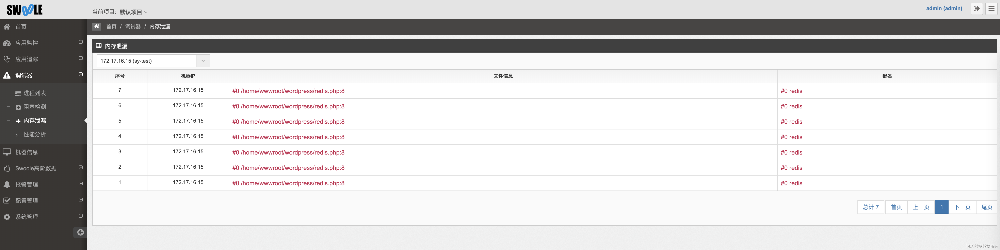
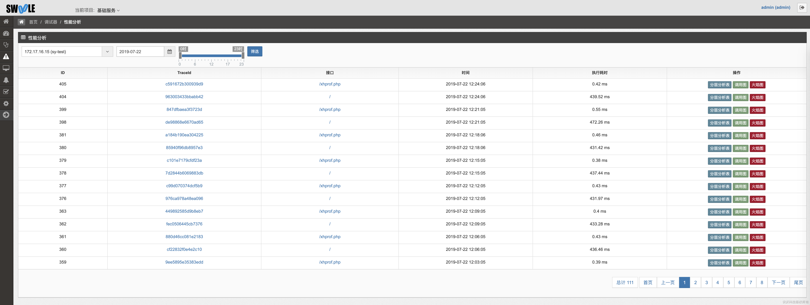
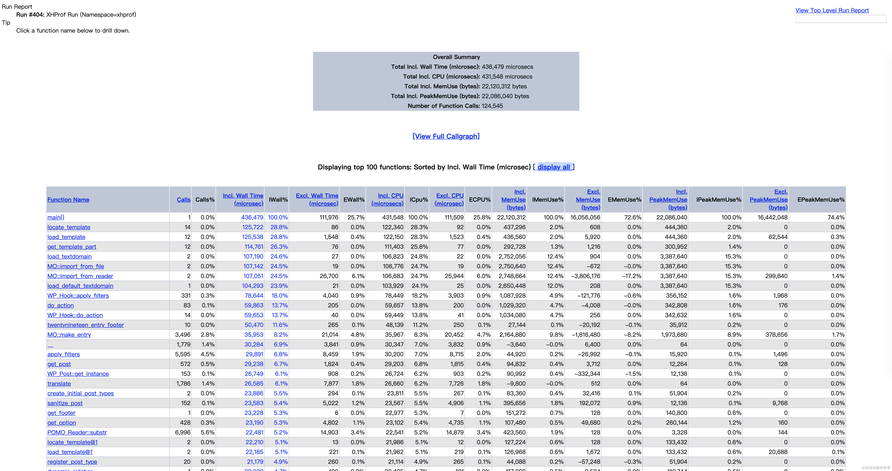
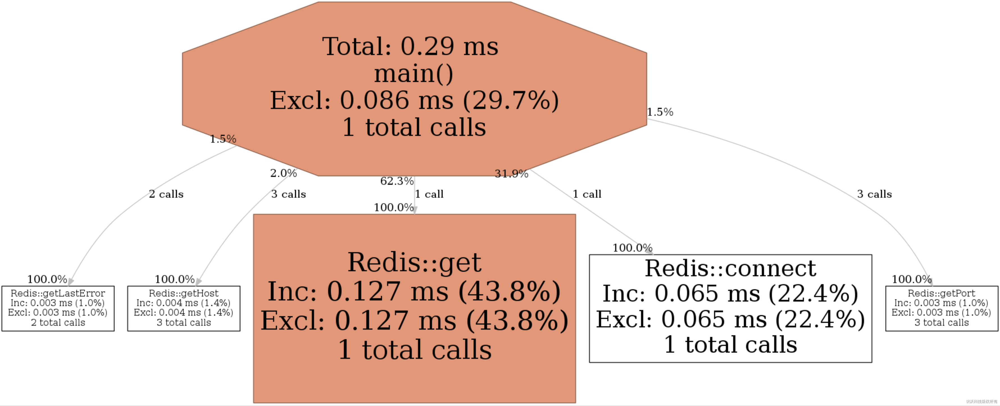
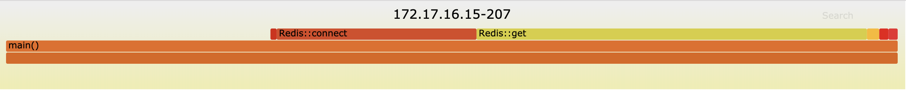
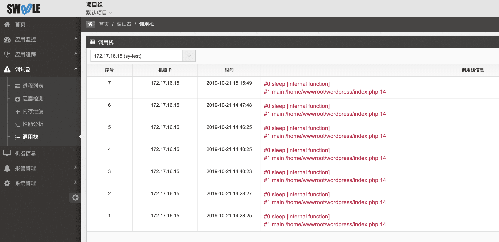

[TOC]

## 进程列表

统计客户端fpm和cli的pid，可进行远程调试、查看调用栈以及进程CPU和内存占用统计

## 远程调试

对于以下四种工具，可以直接在服务端点击按钮远程开启后进行调试，无需修改代码，重启服务。开启后发生请求，日志自动上传服务端后台进行分析展示

>[danger] 对性能有所影响，开启调试完毕后请及时关闭。

### 阻塞检测

可详细看到阻塞的堆栈信息，执行耗时，系统调用信息

### 内存泄漏
>[danger]  ⚠️此功能仅支持 PHP71+ 版本，即PHP71、PHP72、PHP73

会获取到存在内存泄漏的文件堆栈信息，说明你需要在代码逻辑执行完毕后将该键名 `unset` 掉，就可以解决内存泄漏问题

### 性能分析

性能分析可以生成分层分析表、调用图和火焰图，都可以直观的找到对应的瓶颈所在

#### 分层分析表

#### 调用图

#### 火焰图

### 查看调用栈

>[danger] 此功能目前只限付费用户使用

方便定位 PHP 卡死问题，包括但不限于`死循环`、`sesstion_start函数导致卡死`、`flock函数导致卡死`、`TCP超时时间为-1`、`swoole协程的lock`等。

**开启并且发生请求后**就会上报，可以在「调用栈页面」查看，如果页面没有数据则可能数据未上报、未发生卡死问题等
