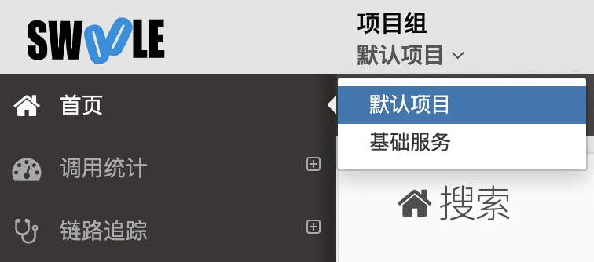

[TOC]

>[success] 上报成功后在后台查看，需要切换当前项目，默认在默认项目中。

>[danger] 可以先查看链路追踪，首页和调用统计需要时间进行分析。

## php-fpm模式

如果你只使用的php-fpm模式，那么到此为止服务端后台应该在发生请求后已经有数据了

fpm下会自动创建应用，名称为域名或对应ip，可以登录服务端后台查看应用追踪等数据

## 常驻进程Service模式

### 自动创建
系统支持自动生成应用名称并创建应用，无需修改任何代码。

如果使用 `Swoole` 的 `HttpServer` 那么生成的应用名称为`ip:port`

如果使用 `Swoole` 其他的 `Server` 那么生成的应用名称为`ip(hostname):port`

查看对应的应用信息即可。