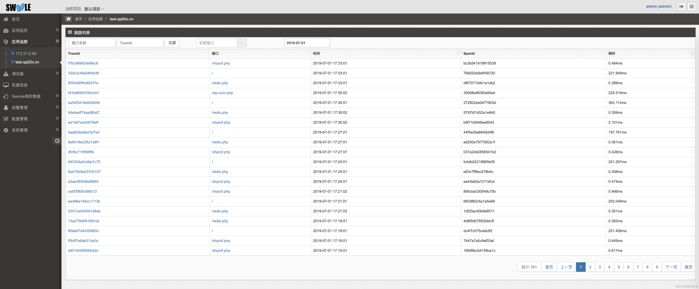
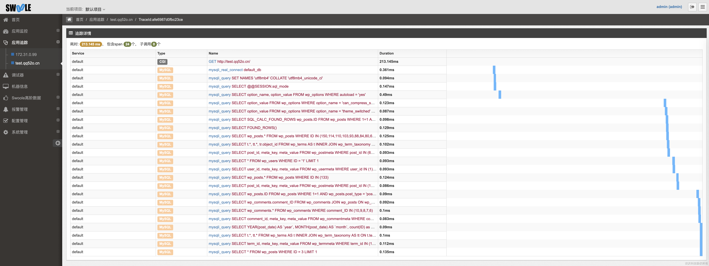
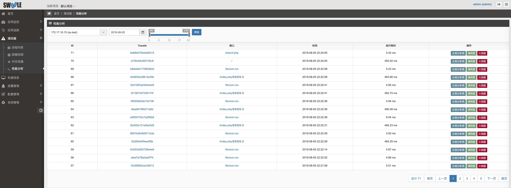

链路追踪生成`Trace信息`，在发生请求后，这里会优先展示链路信息。

>[danger] 如果采样率为百分百时，发现前几次的请求不会被抓取到，这是因为客户端会获取相关应用ID等信息并生成缓存；

按天查询单个接口的`调用时间`、`耗时时长`及`完整的Trace信息`，快速定位耗时较长的调用。

可配合调试工具进行链路调试

## 调用栈

在 [Agent列表](agent-list.md) 中开启 PHP调用栈，会增加一个调用栈列表，会展示该条 trace 中的一些调用信息