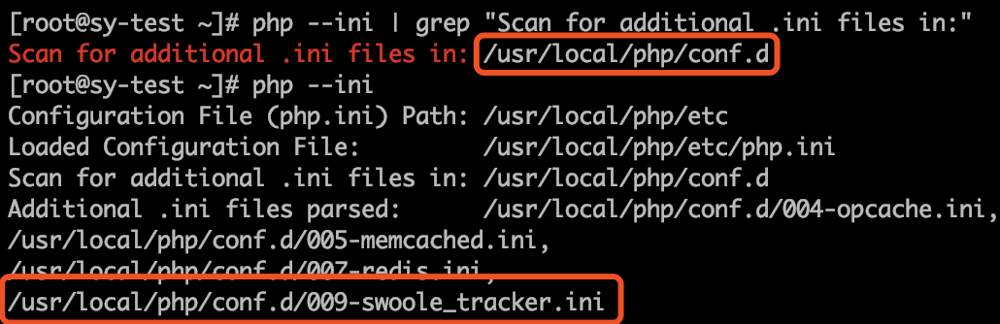
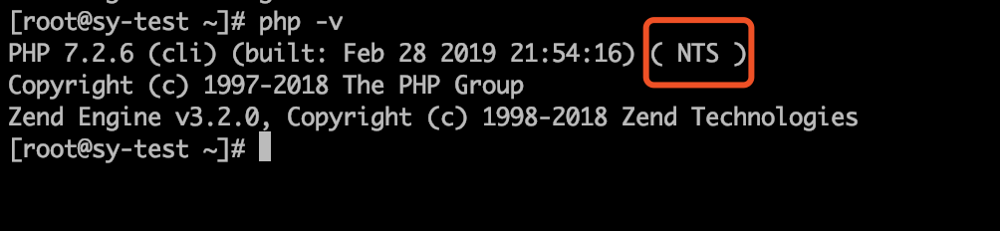

## 加载扩展后报错 undefined symbol: php_pdo_get_exception

扩展需要放在pdo扩展后面加载。使用`php --ini | grep "Scan for additional .ini files in:"`查看第三方加载目录，在此目录中创建一个`swoole_tracker`的配置

## 加载扩展后报错`undefined symbol: compiler_globals in Unknown`

扩展只支持 `NTS` 非线程安全版本 PHP，可使用命令`php -v`查看

## 加载扩展后报错`undefined symbol: _zval_ptr_dtor in Unknown`

下载的`swoole_tracker.so`与机器的`PHP`版本不一致，请确保下载了正确的扩展。